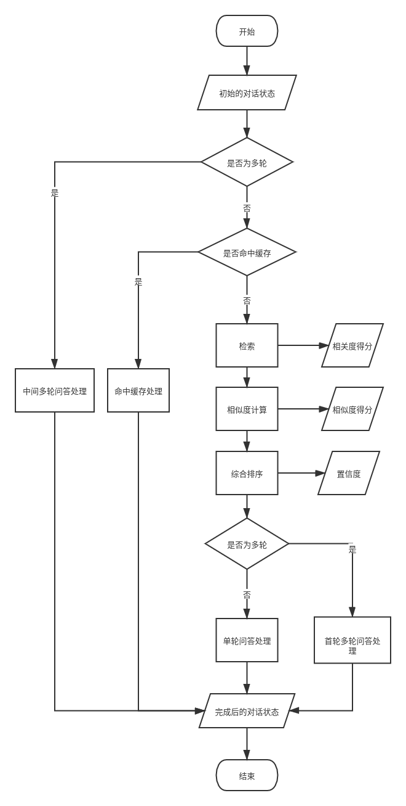
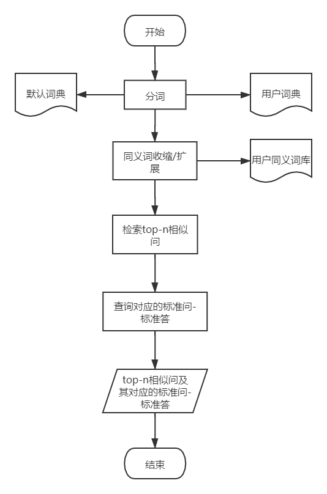

# 对话微服务

## 服务名

`microservice-dialogue`
  
## 功能

负责处理整个对话流程，实现人机对话，自动回答用户所提出的问题。

以下为已实现的功能：

- 单轮/多轮问答

- 记录未识别的问题

以下为待实现的功能：

- 推荐问题（当判断系统回答可能不合用户要求时，列出推荐问题供用户参考）

- 历史记录（记录用户所有的聊天记录并提供查询功能）

- 对系统回答进行赞/踩（用于优化后台数据模型）
  
## 对外开放端口

`87xx`,当启动多个微服务实例时，建议在该范围内设置端口号

## 接口说明

### 接口详情

| 接口详情 |  |
| ---- | ---- |
| 地址 | host:port/dialogue/ask |
| 方式 | get |

### 请求参数

| 字段 | 说明 | 类型 | 备注 | 是否必填 |
| ---- | ---- | ---- | ---- | ---- |
| user_id | 用户id | int | 识别用户的唯一标识 | 是 |
| question | 用户问题 | str | 用户提问的问题 | 是 |
| robot_id | 机器人id | int | 默认为1，针对多场景下用于选择不同机器人，目前没有该功能 | 否 |
  
### 返回参数

| 返回类型 | 数据结构 | 说明 |
| ---- | ---- | ---- |
| JSON | `{code:xx,msg:xx,data:xx}` | code(int)表示状态码，msg(str)表示状态说明，data(object)表示数据内容 |

关于状态码及其说明参考下表

| 状态码 | 类型 | 状态说明 | 备注 |
| ---- | ---- | ---- | ---- |
| 10001 | 模块异常 | elasticsearch异常 |  |
| 10002 | 模块异常 | mysql异常 |  |
| 10003 | 模块异常 | 相似度计算模型异常 |  |
| ---- | ---- | ---- |  |
| 20001 | 成功，有返回值 | success-->单轮 |  |
| 20002 | 成功，有返回值 | success-->多轮 |  |
| ---- | ---- | ---- |  |
| 30001 | 中间状态 | 处于多轮问答中，但未命中多轮问答的选项，此时将重新检索用户问题 | 中间状态只用于服务流程内部，不做为最终状态返回 |
| ---- | ---- | ---- |  |
| 40001 | 失败，无返回值 | failed-->无法识别的问题 |  |
| 40002 | 失败，无返回值 | 没有找到对应的多轮问答树 |  |
| 40003 | 失败，无返回值 | failed-->redis中多轮问答树为空 |  |
| 40004 | 失败，无返回值 | failed-->多轮问答树子节点为空 |  |

# 对话流程图



# 问题检索流程图



# 启动步骤

在启动微服务应用之前，需要确保对应的数据库和微服务组件已经正常启动

## 1. 配置数据库服务器

确保对应的数据库服务器Elasticsearch,Redis已经正常启动，并修改`application.yml`中对应的服务器地址

```yaml
spring:
  #redis连接
  redis:
    host: 127.0.0.1
    port: 6379
    database: 15
#es连接
elasticsearch:
  #节点1(若有集群，可往后追加，并修改配置类config/ElasticsearchConfig.java)
  node-1:
    host: localhost
    port: 9200
```

## 2. 配置Nacos服务器

确保服务发现与注册中心Nacos服务器已经正常启动，并修改`application.yml`中对应的服务器地址

```yaml
spring:
  cloud:
    nacos:
      discovery:
        # 指定nacos server的地址
        server-addr: localhost:8848
```

## 3. 配置Sentinel控制台

确保Sentinel控制台已经正常启动，并修改`application.yml`中对应的控制台地址

```yaml
spring:
  cloud:
    sentinel:
  #    filter:
  #      # 打开/关闭对springMVC端点的保护
  #      enabled: true
      transport:
        # 指定sentinel控制台
        dashboard: localhost:8080
```

## 4. 配置相似度计算服务地址

确保相似度计算服务已经正常启动，并修改`appalication.yml`中对应的url

```yaml
#相似度计算配置
similarity:
  #模型1（如有多种相似度模型，可往后追加并修改配置类config/SimilarityConfig.java）
  #若使用nginx反向代理，则写被nginx转发的地址
  model-1:
    request-url: http://[::1]:6100/calculate_similarity
```

## 5. 修改自定义配置，主要是一些对话参数

编辑`appalication.yml`

```yaml
#检索配置
retrieval:
  #es索引，用于和MySQL表同步和检索数据，默认mysql表和es索引同名
  index:
    #标准问-标准答
    stdq_stda: stdq_stda
    #标准问-相似问
    stdq-simq: stdq_simq
  search:
    #搜索返回的最相关docs的个数
    size: 80

#对话配置
dialogue:
  #置信度排序
  confidence-rank:
    #返回的置信度最高的doc的个数
    size: 5
    #置信度计算权重
    weights:
      #相关度权重
      relevance-weight: 1e-6
      #相似度权重
      similarity-weight: 1
    #阈值（暂未配置该项参数）
    threshold: 0.8

  #用户对话状态
  status:
    #过期时间(单位: minute)
    expire-time: 2
  #redis热点数据缓存
  hot-data:
    #是否开启
    open: true
    #过期时间(单位: minute)
    expire-time: 5

```

## 6. 启动微服务

运行jar包或运行启动类`MicroserviceDialogueApplication.java`，启动成功后可以对接口进行测试
