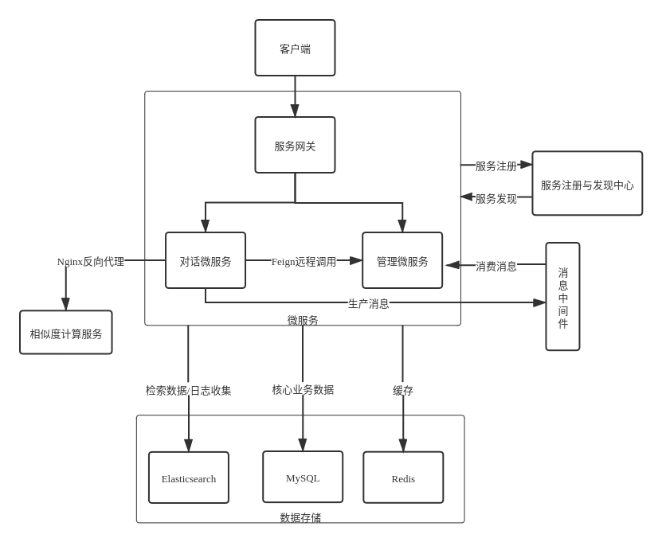

# FAQ问答系统

采用了微服务架构，是对[单体架构](https://github.com/lerry-lee/faq-qa-sys)的升级。

项目采用了Spring Boot,Spring Cloud Alibaba,MyBatis等核心技术，同时提供了前端界面用于访问系统。

# 系统架构图



# 组织结构

```text
faq-qa-sys-v2
├── gateway                 -- 基于Spring Cloud Gateway的微服务API网关服务
├── microservice-dialogue   -- 对话微服务
└── microservice-management -- 管理微服务
```

# 项目功能

## 对话系统

对话系统已实现的功能如下：

- 单轮/多轮问答
- 记录未识别问题
- 历史记录
- 收集用户反馈

## 管理系统

管理系统已实现的功能如下：

- 全量同步
- 批量导入问答对/相似问对
- 更新问答对/相似问对
- 删除问答对/相似问对
- 记录未识别问题

# 技术选型

## 数据库

| 技术 | 说明 |
| ---- | ---- |
| MySQL | 关系型数据库 |
| Redis | 缓存数据库 |
| Elasticsearch | 检索引擎/文档型数据库 |

## 后端

| 技术 | 说明 |
| ---- | ---- |
| Spring Boot | Java应用框架 |
| Spring Cloud | 微服务框架 |
| Spring Cloud Alibaba | 微服务框架 |
| MyBatis | ORM框架 |
| MyBatis Generator | 数据层代码生成器 |
| Lombok | 简化对象封装工具 |
| Log4j2 | 日志管理 |
| SpringFox Swagger2 | API文档框架 |
| Rest high level client | Elasticsearch Java客户端 |

## 工具中间件

| 工具 | 说明 |
| ---- | ---- |
| Nginx | Web服务器 |
| Kibana | 数据可视化工具 |
| Nacos | 服务发现与注册中心 |
| Sentinel | 流量控制组件 |
| Ribbon | 客户端负载均衡工具 |
| RocketMQ | 消息中间件 |

## 前端

| 技术| 说明 |
| ---- | ---- |
| ChatUI | 搭建智能对话机器人的前端框架 |
| LayUI | 前端框架 |

# 环境搭建

## 开发环境

| 工具 | 版本 |
| ---- | ---- |
| JDK | 1.8 |
| MySQL | 8.0 |
| Redis | 5.0 |
| Elasticsearch | 6.8.13 |
| Kibana | 6.8.13 |
| Nginx | - |
| Nacos Server | 1.4.1 |
| Sentinel Dashboard | 1.8.0 |
| RocketMQ | 4.8.0 |

## 搭建步骤

### JDK

关于JDK的配置可参考[该教程](https://www.runoob.com/java/java-environment-setup.html#linux-install)

### Redis

关于Redis的下载安装和启动可参考[该教程](https://www.runoob.com/redis/redis-install.html)

### Elasticsearch6.x(6.8.13)

1. 关于Elasticsearch6.x的下载安装和启动可参考[该教程](https://www.elastic.co/guide/en/elasticsearch/reference/6.8/getting-started-install.html)

```shell
  #cd到es目录
  bin/elasticsearch
```

2. 配置中文分词插件

下载和es对应版本的[ik分词插件](https://github.com/medcl/elasticsearch-analysis-ik/releases)，解压里面的内容到es根目录的`plugins/ik`

新建用户自定义词典`data/dictionary/user_word.dic`放在es根目录的`plugins/ik/config/user_word.dic`

`user_word.dic`内容示例如下（一个自定义词一行）：

```text
兰陵王入阵曲
```

然后在用户自定义词典的统计目录下，修改ik配置`vim IKAnalyzer.cfg.xml`
```text
    <!--用户可以在这里配置自己的扩展字典 -->
    <entry key="ext_dict">user_word.dic</entry>
```

3. 配置同义词库

新建同义词库`data/dictionary/synonym.txt`放在es根目录的`config/analysis/synonym.txt`

`synonym.txt`内容示例如下（使用最简单的表达形式）

```text
jump,leap,hop
```

如果遇到这些词项中的任何一项，则将其替换为所有列出的同义词。关于其他同义词形式参考[官方文档](https://www.elastic.co/guide/cn/elasticsearch/guide/current/synonym-formats.html)

### MySQL

1. 关于MySQL的下载安装和启动可参考[该教程](https://www.runoob.com/mysql/mysql-install.html)

2. 启动成功后，通过命令`use qadb;` 进入`qadb`数据库，若没有可通过如下语句创建

```shell
CREATE DATABASE IF NOT EXISTS qadb DEFAULT CHARSET utf8 COLLATE utf8_general_ci;
```

3. 导入项目根目录下`/sql/qadb.sql`，将在`qadb`数据库中创建4张表`stdq_stda`和`stdq_simq`，`feedback`和`history`，使用以下命令导入

```sql
source qadb.sql;
```

### Nginx

Nginx是高性能的Web和反向代理服务器 ，关于Nginx的安装配置可参考[该教程](https://www.runoob.com/linux/nginx-install-setup.html)

```shell
  #cd到nginx目录，启动
  sudo sbin/nginx -c conf/nginx.conf
  #cd到nginx目录，平滑重启
  sudo sbin/nginx -c conf/nginx.conf -s reload
```

1. 拦截静态页面

```text
    # 编辑nginx.conf
   server {
        listen       8600;
        server_name  localhost;
        # 配置对话页面的请求路由
        location /qa-ui {
            alias /home/lca/code/ui/qa-ui/;
            index dialogue.html;
        }
    }
```

2. 转发其他请求

```text
   server {
        listen       8600;
        server_name  localhost;
        # 转发其他请求到服务网关
        location / {
            proxy_pass http://localhost:8900;
            proxy_set_header Host $http_host;
            proxy_set_header X-Real-IP $remote_addr;
            proxy_set_header X-Forwarded-For $proxy_add_x_forwarded_for;
            proxy_http_version 1.1;
            proxy_set_header Connection "";
        }
    }
```

3. 配置相似度服务代理

```text
    # 假定启动两个相似度模型服务，端口号分别为6661和6662，weight表示访问权重
    upstream sim_server {
        server localhost:6101 weight=1;
        server localhost:6102 weight=1;
        keepalive 30;
    }
    # 6100端口的/sim请求将被转发到sim_server上
    server {
        listen       6100;
        server_name  localhost;
        # 转发其他请求到服务网关
        location /sim {
            proxy_pass http://sim_server;
            proxy_set_header Host $http_host;
            proxy_set_header X-Real-IP $remote_addr;
            proxy_set_header X-Forwarded-For $proxy_add_x_forwarded_for;
            proxy_http_version 1.1;
            proxy_set_header Connection "";
        }
    }
```

重启nginx，可通过localhost:8600/qa-ui访问对话页面

### Nacos Server

搭建Nacos Server,可参考[官方文档](https://Nacos.io/zh-cn/docs/quick-start.html)

1. 下载和Spring Cloud Alibaba版本对应的Nacos
   
2. 启动服务器

    ```shell
        # Linux/Unix/Mac 启动命令(standalone代表着单机模式运行，非集群模式):
        sh startup.sh -m standalone
        
        # 如果您使用的是ubuntu系统，或者运行脚本报错提示[[符号找不到，可尝试如下运行：
        bash startup.sh -m standalone
        
        # Windows启动命令(standalone代表着单机模式运行，非集群模式):
        startup.cmd -m standalone
    ```
    
3. 访问`localhost:8848/nacos`，使用`nacos/nacos`登陆控制台

### Sentinel Dashboard

1. 下载Sentinel控制台[Dashboard](https://gitee.com/rmlb/Sentinel#https://github.com/alibaba/Sentinel/wiki/Dashboard)

2. 启动控制台`java -jar sentinel-dashboard.jar`，启动成功后通过浏览器访问`localhost:8080`，使用sentinel/sentinel登陆

### RocketMQ

1. 下载RocketMQ，按照[官方文档](http://rocketmq.apache.org/docs/quick-start/)启动Name Server和Broker

```shell
  #启动name server
  sh bin/mqnamesrv
  #启动broker
  sh bin/mqbroker -n localhost:9876
```

2. 下载控制台[源码](https://gitee.com/mirrors/RocketMQ-Externals)

   1. 用IDE打开rocketmq-console，编辑配置文件`application.properties`
   
   ```text
   # console端口
   server.port=17890
   # nameserver地址
   rocketmq.config.namesrvAddr=localhost:9876
   ```
   
   2. 修改pom依赖
   
   在pom.xml中找到该行，修改版本为你rocketmq的版本
   
   ```xml
      <rocketmq.version>4.8.0</rocketmq.version>
   ```
   
   3. 打包
   
   进入rocketmq-console目录，输入下面命令

   ```shell
      mvn clean package -Dmaven.test.skip=true
   ```
   
   4. 启动
   
   进入target目录，启动jar

   ```shell
      java -jar rocketmq-console-ng-2.0.0.jar
   ```
   
   5. 访问控制台
   
   通过浏览器访问`localhost:17890/#/`

# 项目启动

确保在上一步骤已经完成了环境的搭建，接下来分别启动相似度服务、网关服务、对话微服务和管理微服务

## 相似度服务启动

关于相似度服务的启动参考[readme](https://gitee.com/lerry-lee/similarity-model)

## 网关服务启动

关于网关服务的启动参考[readme](gateway/readme.md)

## 对话微服务启动

关于对话微服务的启动参考[readme](microservice-dialogue/readme.md)

## 管理微服务启动

关于管理微服务的启动参考[readme](microservice-management/readme.md)

# 附录

前端演示UI[QA-UI](https://github.com/lerry-lee/qa-ui)

关于开发过程中的微服务技术的整合、配置步骤，参考[这里](docs/微服务配置步骤.md)


